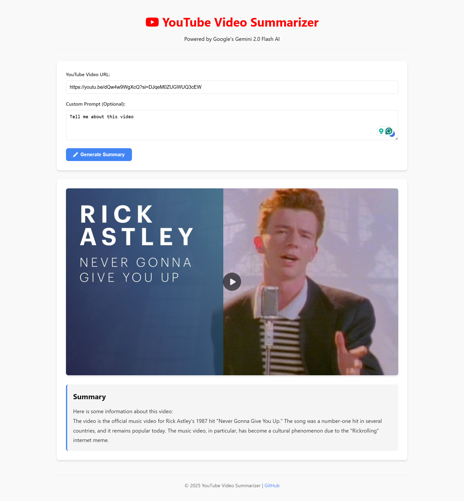

# 🎬 GenKit YouTube Summarizer

A web application that uses Google's Gemini 2.0 Flash model through GenKit to generate concise summaries of YouTube videos with a beautiful user interface.

## 📋 Overview

This project demonstrates how to use GenKit and Google's Gemini AI to process and summarize video content. It provides a user-friendly web interface where you can enter a YouTube video URL and get a text summary of the video's content, along with a thumbnail preview. This makes it easier to quickly understand the key points without watching the entire video.

## ✨ Features

- 🎥 Summarize YouTube videos with AI
- 🔧 Customize the summarization prompt
- 🖥️ Beautiful web interface with video thumbnails
- 🧠 Powered by Google's Gemini 2.0 Flash model
- 🌐 Responsive design that works on desktop and mobile

## 🔍 Prerequisites

Before you begin, ensure you have the following installed:
- 📦 [Node.js](https://nodejs.org/) (v14 or later)
- 📦 npm (comes with Node.js)
- 🔑 A Google AI Studio API key (for accessing Gemini models)

## 🚀 Installation

1. 📥 Clone this repository:
   ```bash
   git clone https://github.com/yourusername/genkit-youtube-summarizer.git
   cd genkit-youtube-summarizer
   ```

2. 📦 Install dependencies:
   ```bash
   npm install
   ```

3. 🔑 Set up your Gemini API Key:

   Note: Git Bash is the recommended terminal for setting Gemini API keys and running other Genkit commands. When running the application, it should be done in the same terminal that was used to set the Gemini API key.

   ```bash
   # In Git Bash (Recommended)
   export GEMINI_API_KEY=<your API key>

   # On Windows (Command Prompt)
   set GEMINI_API_KEY=<your API key>

   # On Windows (PowerShell)
   $env:GEMINI_API_KEY="<your API key>"

   # On macOS/Linux
   export GEMINI_API_KEY=<your API key>
   ```

## 🔧 Usage

1. Start the application:

```bash
# Development mode
npm run dev

# OR Production mode (after building)
npm run build
npm start
```

2. Open your browser and navigate to `http://localhost:3000`

3. Enter a YouTube video URL in the input field

4. (Optional) Customize the prompt to get a specific type of summary

5. Click "Generate Summary" and wait for the AI to process the video

6. View the summary along with the video thumbnail

## 💡 Example

Input:
- YouTube URL: `https://www.youtube.com/watch?v=dQw4w9WgXcQ`
- Custom Prompt: `Create a detailed summary of this video highlighting the main points:`

Output:
- A thumbnail of Rick Astley's "Never Gonna Give You Up" music video
- Summary text:
  ```
  The video is a music video for Rick Astley's 1987 hit song "Never Gonna Give You Up." 
  In the video, Rick Astley performs the song in various urban settings while dancing. 
  The song is about promising unwavering commitment to a relationship, with lyrics 
  emphasizing that he will never give up on, let down, or desert his partner.
  ```

## ⚙️ How It Works

1. 🔗 User enters a YouTube video URL through the web interface
2. 🌐 The browser sends a request to the server API
3. 🤖 The server uses GenKit to interface with Google's Gemini 2.0 Flash model
4. 🧠 The AI processes the video content
5. 🖼️ The server extracts the video ID to generate a thumbnail URL
6. 📝 A text summary is generated and sent back to the browser
7. 🎨 The web interface displays the summary and video thumbnail

## 📷 Screenshot of the Web App


## 📚 Resources

- 📖 [GenKit Documentation](https://genkit.dev/docs)
- 🧠 [Google AI Studio](https://ai.google.dev/)
- 📝 [Tutorial: Summarize YouTube Videos with GenKit](https://genkit.dev/docs/tutorials/tutorial-summarize-youtube-videos/)
